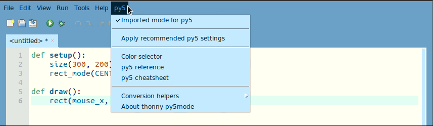
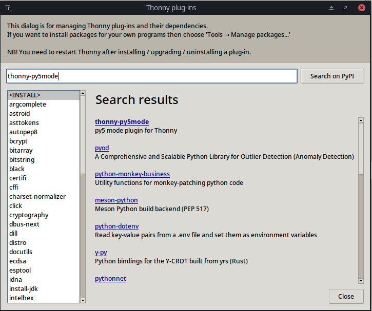
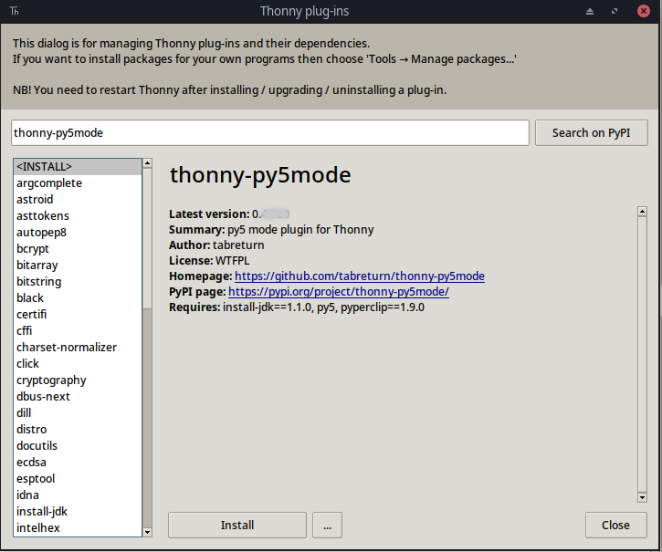

# thonny-py5mode

*A py5 plug-in for Thonny*



This plug-in for the [Thonny IDE](https://thonny.org) can install [py5](https://py5coding.org/), a modern Python framework that leverages Processing's core libraries, adding an *imported mode for py5* feature to Thonny, making it a great alternative for creative coding with Python in a simplified manner similar to the Processing IDE (PDE).

## Instructions

### 1. Download and install the Thonny IDE

*If you have the latest version of Thonny on your computer, you can skip straight to step 2.*

You can download it for **Mac**, **Windows** and **Linux** from https://thonny.org or from [Thonny's repository releases](https://github.com/thonny/thonny/releases/).

Then you launch Thonny, and If you're running it for the first time, just accept the *Standard* settings.


### 2. Install the *thonny-py5mode* plug-in

From Thonny's menu, choose the **Tools > Manage plug-ins...** menu item. 


Search for **thonny-py5mode** it needs to be typed exactly like this.



Click on the blue <strong><ins>thonny-py5mode</ins></strong> link.



Click on the **Install** button. When the installation is complete, you'll need to __restart Thonny__.

Once restarted, a new ***py5* menu** should appear in Thonny's interface, click on the **py5 > Imported mode for py5** menu option.

When you first select this, the plug-in will download, extract and configure the JDK for you (in Thonny's user-config directory).


Allow it to proceed, and be patient as this process can be lengthy depending on your connection, but it only happens the first time you select the menu option.


A message will appear when it is finished.


You can *apply recommended py5 settings* to make a few configuration tweaks to your IDE, including enabling the blue Kianite theme!


### 3. Run a small example, to check everything is working!

With the **py5 > imported mode for py5** option on, you can run the following code using the green arrow button or CTRL+R (COMMAND+R on a Mac). Creative coders usually call their programs sketches.

```python
def setup():
    size(300, 200)
    rect_mode(CENTER)

def draw():
    square(mouse_x, mouse_y, 10)
```

If you have trouble getting your program to execute, try stopping any other execution that is still running.


## Learn about the difference between *imported mode* and *module mode*

#### What is the *imported mode* feature provided by the *thonny-py5mode* plug-in?

The *thonny-py5mode* plug-in creates a *py5* menu in the Thonny interface, inside the *py5* menu, there is an *Imported mode for py5* option that can be turned on or off. When *Imported mode for py5* is on you can write your sketches in a simplified manner, called [imported mode](https://py5coding.org/content/py5_modes.html#imported-mode). It works by making Thonny run your code using the *py5 sketch runner*, a special tool that can also be called from the command line if you are not using Thonny.

**Important note:** The *imported mode* option is not appropriate for executing Python code that doesn't make use of the py5 library!

In *imported mode* the vocabulary of *py5*, that is, the names of functions, constants and system variables (such as the mouse position), are available without the `py5.` prefix (needed on *module mode*, more about it later), and your program will be automatically executed by the `run_sketch` function from *py5*.

With *imported mode* on, you can also run [static mode](https://py5coding.org/content/py5_modes.html#static-mode) sketches, that is, programs without animation or interactivity because they do not have a `draw()` function defined.

#### What is *module mode* and how can I use it?

When you disable the *imported mode for py5* menu option, you return Thonny to its normal behavior for executing any Python code.

In this case, you can use *py5* in [module mode](https://py5coding.org/content/py5_modes.html#module-mode), which is how most Python libraries are handled, i.e. importing the library at the beginning of the program with `import`, and calling its functions with the library name as a prefix.

```python
import py5

def setup():
    py5.size(300, 200)
    py5.rect_mode(py5.CENTER)

def draw():
    py5.square(py5.mouse_x, py5.mouse_y, 10)

py5.run_sketch()
```

Note that you will need to use `import py5` at the beginning of your code, and `py5.run_sketch()` at the end, as well as the `py5.` prefix for all functions, constants and variables offered by the *py5* library.

## Useful py5 resources

- The official py5 documentation at [py5coding.org](http://py5coding.org/)
- The py5 [discussions](https://github.com/py5coding/py5generator/discussions) forum on GitHub
- The py5 category at the [Processing Foundation Forum](https://discourse.processing.org/c/a-version-of-processing-for-python-38-to-work-with-other-popular-python-libraries-and-tools-such-as-jupyter-numpy-shapely-trimesh-matplotlib-and-pillow-built-to-work-with-popular-python-libraries-and-tools-such-as-jupyter-numpy-shapely-etc/28)
- tabreturn's [py5 quick reference](https://github.com/tabreturn/processing.py-cheat-sheet/blob/pt-br/py5/py5_cc.pdf)
- Villares' daily sketches at [sketch-a-day](https://abav.lugaralgum.com/sketch-a-day), mostly done with py5.

## Credits

The **thonny-py5mode** plug-in was initially developed by [@tabreturn](https://github.com/tabreturn), who was inspired by a [proof of concept by @villares](https://github.com/villares/thonny-py5-runner), being thankful to [@hx2A](https://github.com/hx2A/) for the [py5 project](https://py5coding.org/), and the [Thonny folks](https://github.com/thonny) for their fantastic IDE. The *Color selector* incorporates Juliette Monsel's excellent [tkColorPicker](https://github.com/j4321/tkColorPicker) module. From 2025 onward the plug-in became a part of the py5 project and is maintained by its community.

## Contributing

Follow discussions on the [*thonny-py5mode* plug-in GitHub repository](https://github.com/py5coding/thonny-py5mode/discussions/) and [report issues](https://github.com/py5coding/thonny-py5mode/issues).
